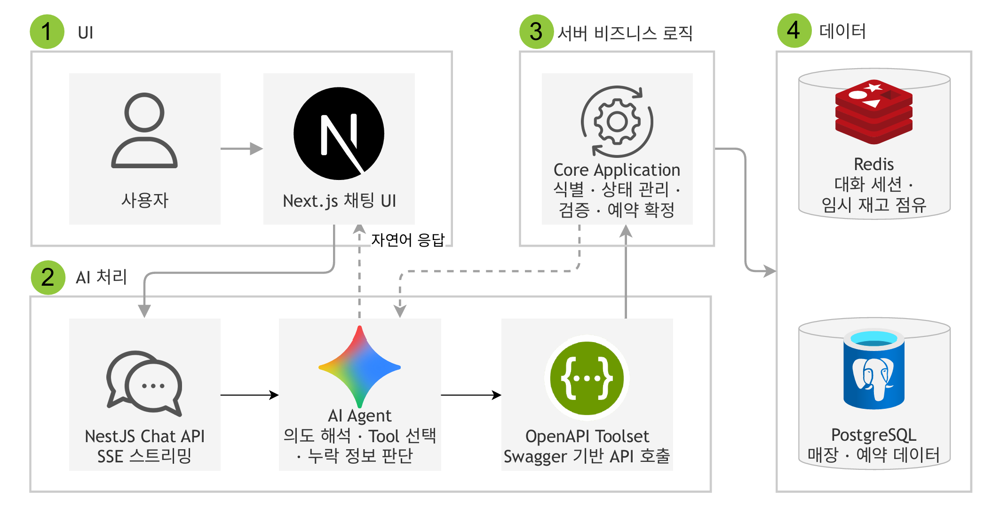
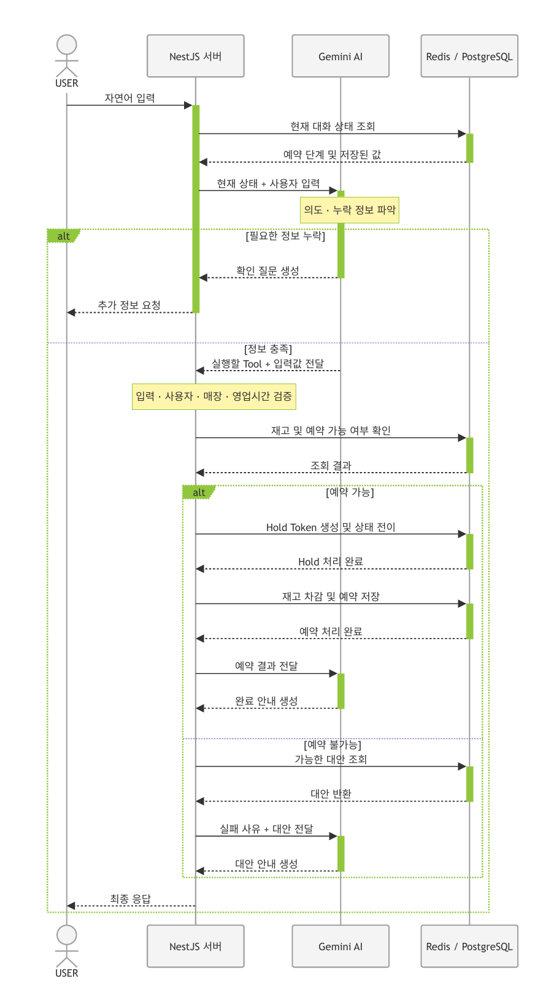

# Bread-Agent

Bread-Agent는 사용자의 위치와 빵 취향을 바탕으로 매장과 메뉴를 추천하고 예약, 취소까지 처리하는 대화형 AI 서비스입니다.<br> 
AI는 의도 해석, Tool 선택을, 서버는 예약 관련 로직, 정보 검증을 담당하도록 책임을 분리하여 AI의 환각에도 정합성을 지키는 시스템을 구축했습니다. 


## 기술 스택 및 아키텍처

### 기술 스택

| 구분 | 기술 / 버전 | 도입 목적 |
| --- | --- | --- |
| Language / Framework | TypeScript 5.7, NestJS 11, Next.js 15.5 | 예약 API와 SSE 기반 채팅 UI |
| AI / Tool Integration | Google ADK 1.1, Gemini 3.1 Flash-Lite, Swagger 11.4 | OpenAPI 명세에서 Function Tool을 생성, 기존 API와 연결 |
| Database / Cache | PostgreSQL, TypeORM 0.3, Redis, ioredis 5.10 | 예약 / 재고 영속화, 세션 / Hold TTL 관리 |
| Validation / Streaming | Zod 4.4, nestjs-zod 5.3, SSE, RxJS 7.8 | 입력 검증, AI 응답 스트리밍 |
| Test / Tools | Jest 30, Supertest 7, ESLint 9, Prettier 3.4 | e2e 테스트 및 코드 품질 관리 |

### 아키텍처 및 AI 예약 처리 흐름

#### 전체 시스템 아키텍처
<p align="center">
  
</p>

#### AI Agent 기반 예약 처리 시퀀스

<details>
<summary>전체 예약 처리 시퀀스 클릭</summary>



</details>


## 핵심 기술적 문제 해결

### 1. 합성 Tool과 책임 분리를 통한 응답 시간 55% 단축

**Problem:** AI가 매장, 재고, 취향 데이터를 여러 Tool에 나눠 조회하고 상태를 변경했습니다. 그 결과 4단계 예약 대화의 평균 응답 시간이 37.5초까지 증가했습니다.

**Cause:** 연관 데이터를 개별 Tool로 조회해 LLM 왕복 횟수가 많았고, 확정적으로 처리할 수 있는 검증까지 AI 추론에 포함되어 있었습니다.

**Fix:** 상위 모델인 Gemini 2.5도 검토했지만 평균 비용이 약 33% 증가해 기존 Gemini 3.1 Lite를 유지했습니다. 대신 매장, 메뉴, 취향 등 정보를 한 번에 조회하는 합성 Tool을 구성하고, 상태 관리, 최종 예약 검증 등은 서버로 이관했습니다.

**Result:** 동일한 4단계 예약 시나리오 기준 평균 응답 시간이 37.5초에서 16.5초로 줄어 약 55% 단축됐습니다. 

<details>
<summary>관련 코드 및 파일</summary>

- [`store.repository.ts`](src/store/repository/store.repository.ts): 매장·메뉴·재고·취향 태그를 합성 조회합니다.
- [`reservation.service.ts`](src/reservation/service/reservation.service.ts): Hold를 재검증하고 재고 차감과 예약 생성을 원자적으로 처리합니다.

```typescript
// 추천에 필요한 매장·메뉴·재고·태그를 한 번의 쿼리로 조회합니다.
const qb = this.dataSource
  .createQueryBuilder()
  .from(Store, 'store')
  .leftJoin(Inventory, 'inv', 'inv.store_id = store.id')
  .leftJoin(Bread, 'bread', 'bread.id = inv.bread_id')
  .leftJoin('inventory_tag', 'it', 'it.inventory_id = inv.id')
  .leftJoin(Tag, 'tag', 'tag.id = it.tag_id')
  .where('store.station = :station', { station: query.station });
```

</details>

### 2. Redis 세션과 State Machine을 통한 예약 상태 정합성 확보

**Problem:** AI가 대화 문맥만으로 예약 단계를 판단하면서 완료한 검색 Tool을 다시 호출하거나, 필수 정보 없이 다음 단계로 넘어가는 문제가 있었습니다.

**Cause:** 예약 단계와 세션 파라미터 변경을 AI 판단에 의존했고, 서버가 허용된 상태 전이와 필수 데이터 조건을 강제하지 않았습니다.

**Fix:** AI는 의도 해석과 Tool 선택만 담당하도록 제한했습니다. 서버가 Tool 실행 결과를 Redis 세션에 저장하도록 변경했습니다. State Machine이 허용된 전이와 필수 데이터 존재 여부를 검증하도록 변경했습니다. 

**Result:** 실제 서버 상태를 기준으로 예약 단계를 관리하고, 필수 정보가 없거나 순서에 맞지 않는 요청을 차단해 Tool 중복 호출과 잘못된 상태 저장을 방지했습니다.

<details>
<summary>관련 코드 및 파일</summary>

- [`session-state.validator.ts`](src/session/session-state.validator.ts): 서버가 허용하는 예약 상태 전이를 정의합니다.
- [`ai.service.ts`](src/ai/ai.service.ts): Redis 상태를 기준으로 빈 응답 Fallback을 처리합니다.

```typescript
// 서버에서 허용하는 예약 상태 전이만 명시합니다.
const SERVER_STATE_TRANSITIONS = {
  [SessionStatus.SEARCHING]: [SessionStatus.READY_FOR_SUMMARY],
  [SessionStatus.READY_FOR_SUMMARY]: [
    SessionStatus.WAITING_FOR_CONFIRM,
    SessionStatus.SEARCHING,
  ],
  [SessionStatus.WAITING_FOR_CONFIRM]: [
    SessionStatus.COMPLETED,
    SessionStatus.EXPIRED,
    SessionStatus.READY_FOR_SUMMARY,
  ],
} as const;

export function isServerStateTransitionAllowed(
  current: SessionStatusType,
  next: SessionStatusType,
): boolean {
  return SERVER_STATE_TRANSITIONS[current].includes(next);
}
```

</details>

### 3. Swagger 기반 Function Tool 자동 생성

**Problem:** 서버 API마다 API 관련 정보를 Function Tool 형식으로 다시 선언하여 API 추가와 요청 DTO 변경 시 두 정의를 함께 수정해야 했습니다.

**Cause:** 수정하는 과정에서 필드 누락과 타입 불일치 가능성이 있었습니다.

**Fix:** NestJS가 생성한 Swagger 문서에서 operation, path, query 파라미터와 JSON 요청 스키마를 읽어 Gemini Function Tool로 변환했습니다. 

**Result:** API 명세를 Function Tool 정의의 단일 기준으로 사용해 API별 Tool 선언 작업을 줄이고, 요청 DTO 변경을 Tool 생성 흐름에 반영할 수 있게 했습니다.

<details>
<summary>관련 코드 및 파일</summary>

- [`main.ts`](src/main.ts): 실행 중인 API에서 Swagger 문서를 생성합니다.
- [`open-api-toolset.ts`](src/ai/open-api-toolset.ts): OpenAPI operation과 스키마를 Gemini Function Tool로 변환합니다.

```typescript
// Swagger operation마다 실행 가능한 Function Tool을 생성합니다.
for (const [path, pathItem] of Object.entries(paths)) {
  for (const [method, operation] of Object.entries(pathItem)) {
    if (!HTTP_METHODS.has(method)) continue;
    if (!operation?.operationId) continue;
    if (this.excludedOperations.has(operation.operationId)) continue;

    const tool = this.createApiFunctionTool(
      path,
      method,
      operation,
      components,
    );
    if (tool) tools.push(tool);
  }
}
```

</details>

## 실행 및 테스트

### 요구 환경

- Node.js
- npm
- PostgreSQL
- Redis
- Gemini API Key

### 환경 변수

백엔드와 프런트엔드는 각각 전용 환경 변수 파일을 사용합니다.

<details>
<summary>환경 변수</summary>

```env
DB_HOST=localhost
DB_PORT=5432
DB_USERNAME=postgres
DB_PASSWORD=
DB_DATABASE=bread_db

REDIS_HOST=localhost
REDIS_PORT=6379

GEMINI_API_KEY=
API_BASE_URL=http://localhost:8080
AI_CHAT_TIMEOUT_MS=120000
PORT=8080
NODE_ENV=development

NEXT_PUBLIC_API_BASE_URL=http://localhost:8080
```

</details>

### 실행 및 테스트

# Backend
npm run start:dev

# Frontend
cd frontend
npm run dev

# Test
npm test
npm run test:e2e

Backend: http://localhost:8080
Frontend: http://localhost:3000
Swagger: http://localhost:8080/swagger
